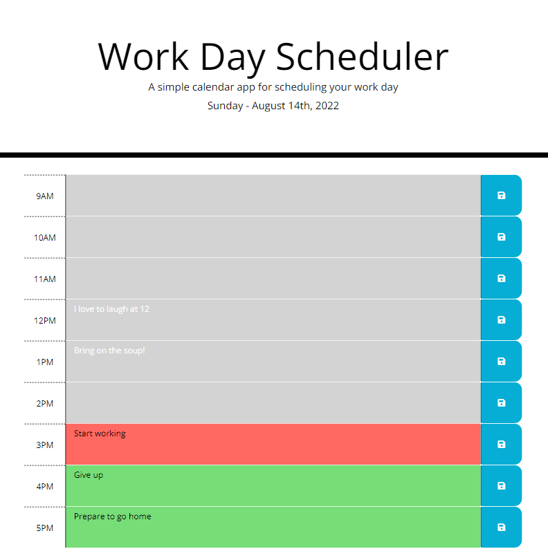

# Work Schedule

## Description

A schedule to help keep track of tasks during the work day.

## Usage

Past hours ar colored gray, the current hour is colored red, and future hours are colored green.

To add tasks, click in the colored box for the desired hour and begin to type. When finished entering the tasks, click the save button for that hour so that they remain present on page reload.

## Link and Screenshot

Link to Deployed Application:

* [Work Schedule](https://acotterson.github.io/WorkSchedule/)

Screenshot:

